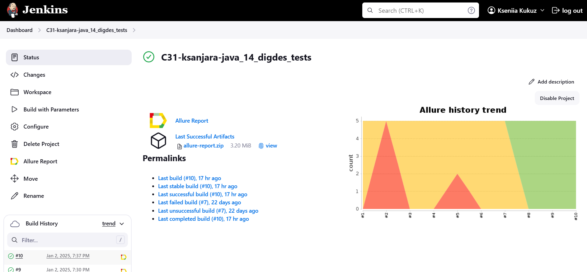
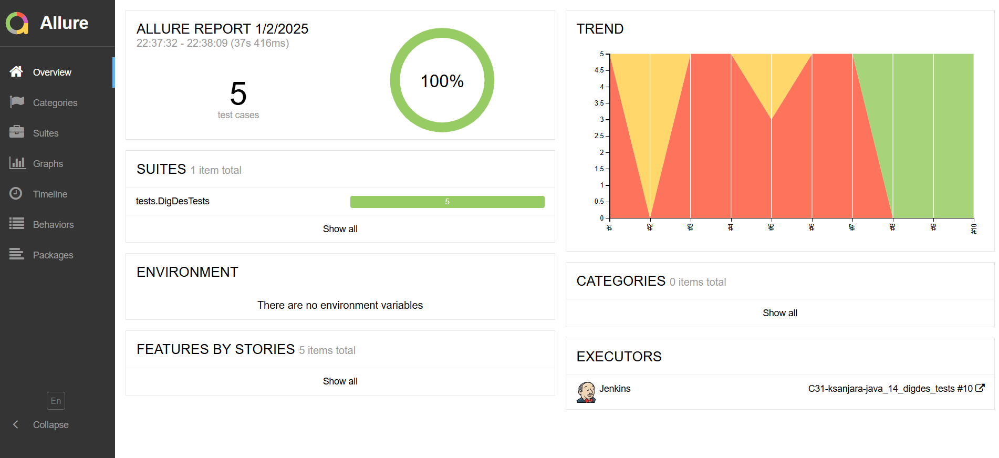
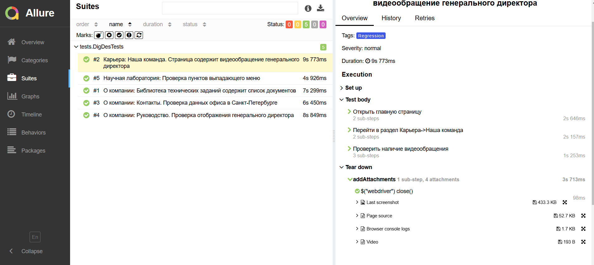
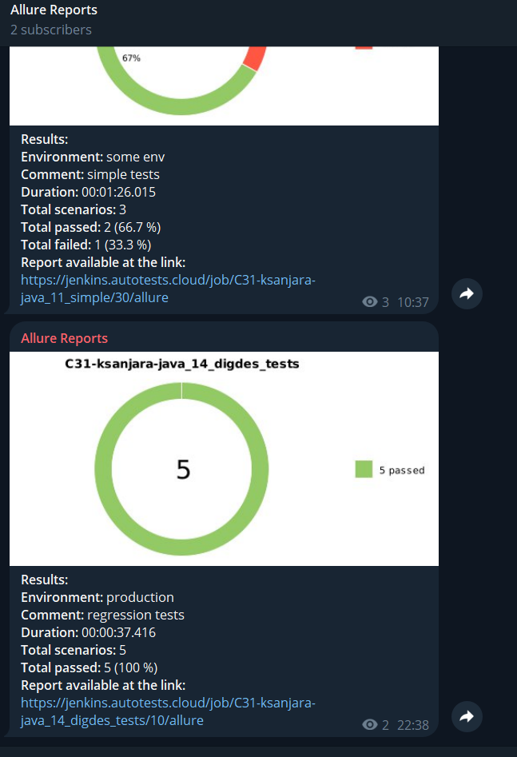
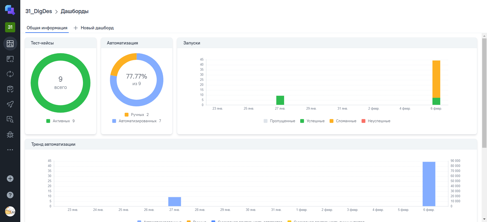
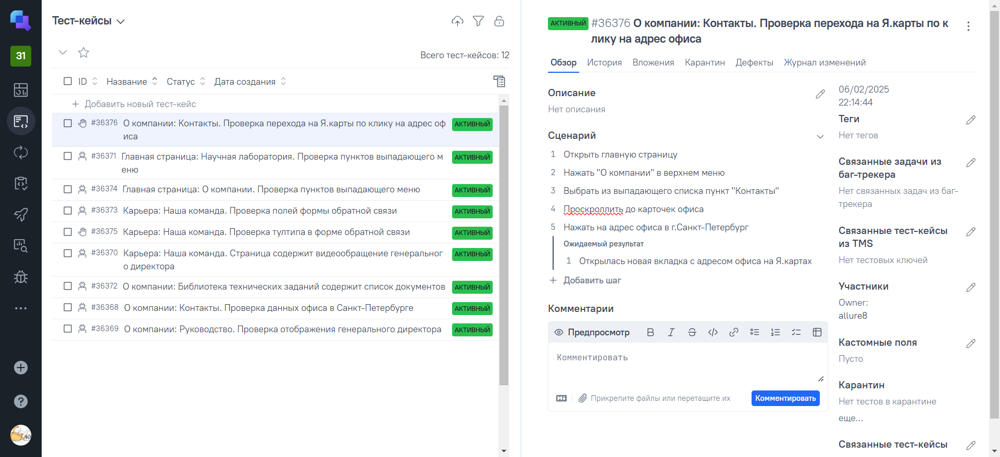
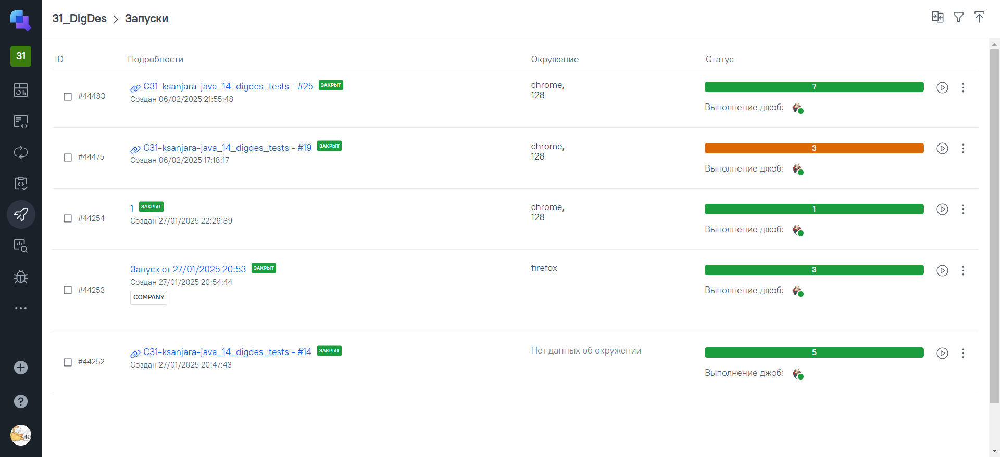
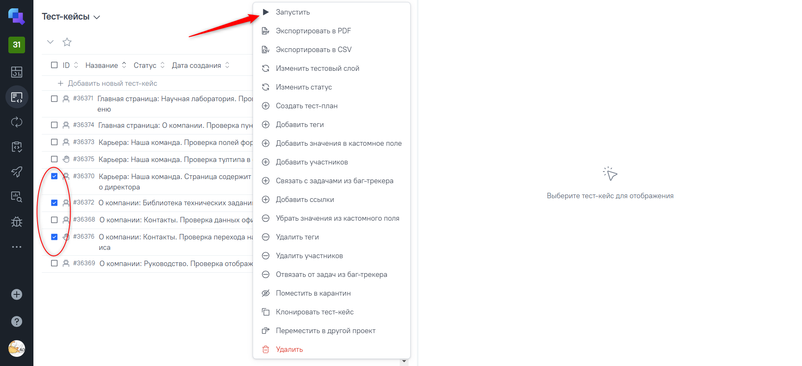
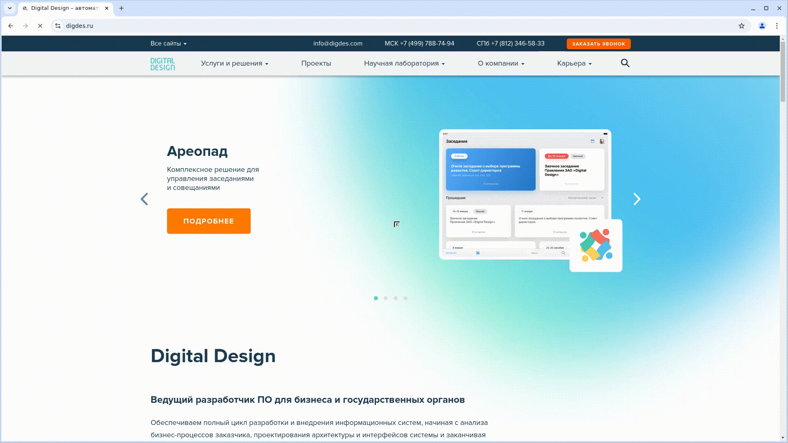

<p align="center"> 

</p>

# Проект по автоматизации тестовых сценариев для сайта компании [Digital Design](https://digdes.ru/)
## :page_with_curl: Содержание:

- <a href="#tools">Использованный стек технологий</a>
- <a href="#launch"> Запуск автотестов </a>
- <a href="#build"> Сборка в Jenkins </a>
- <a href="#allureReport"> Пример Allure-отчета </a>
- <a href="#tg"> Уведомления в Telegram с использованием бота </a>
- <a href="#allureOps"> Интеграция с Allure TestOps </a>
- <a href="#selenoid"> Видео примера запуска тестов в Selenoid </a>

<a id="tools"></a>
## 🔨 Использованный стек технологий

| Java                                                                                                    | IntelliJ  <br>  Idea                                                                                                      | GitHub                                                                                                    | JUnit 5                                                                                                          | Gradle                                                                                                    | Selenoid                                                                                                                 | Allure <br> Report                                                                                                               | Jenkins                                                                                                         | Selenide                                                                                                                           | Telegram                                                                                                           |                                                                                               Allure <br> TestOps |
|:--------------------------------------------------------------------------------------------------------|---------------------------------------------------------------------------------------------------------------------------|-----------------------------------------------------------------------------------------------------------|------------------------------------------------------------------------------------------------------------------|-----------------------------------------------------------------------------------------------------------|--------------------------------------------------------------------------------------------------------------------------|----------------------------------------------------------------------------------------------------------------------------------|-----------------------------------------------------------------------------------------------------------------|------------------------------------------------------------------------------------------------------------------------------------|--------------------------------------------------------------------------------------------------------------------|------------------------------------------------------------------------------------------------------------------:|
| <a href="https://www.java.com/"></a> | <a href="https://www.jetbrains.com/idea/"></a> | <a href="https://github.com/"></a> | <a href="https://junit.org/junit5/"></a> | <a href="https://gradle.org/"></a> | <a href="https://aerokube.com/selenoid/"></a> | <a href="https://github.com/allure-framework"></a> | <a href="https://www.jenkins.io/"></a> | <a href="https://ru.selenide.org/"></a> | <a href="https://web.telegram.org/"></a> | <a href="https://qameta.io/"></a> |


- В данном проекте автотесты написаны на языке <code>Java</code> с использованием фреймворка для тестирования Selenide.
- В качестве сборщика был использован - <code>Gradle</code>.
- Использованы фреймворки <code>JUnit 5</code> и [Selenide](https://selenide.org/).
- При прогоне тестов браузер запускается в [Selenoid](https://aerokube.com/selenoid/).
- Для удаленного запуска реализована джоба в <code>Jenkins</code> с формированием Allure-отчета и отправкой результатов в <code>Telegram</code> при помощи бота.
- Также реализована интеграция с `Allure TestOps` для тестовой документации с возможностью сборки тестовых прогонов и их запуска.

Содержание Allure-отчета:
* Шаги теста;
* Скриншот страницы на последнем шаге;
* Page Source;
* Логи браузерной консоли;
* Видео выполнения автотеста.

<a id="launch"></a>
## :arrow_forward: Запуск автотестов

### Запуск тестов из терминала
Локально:
```
gradle clean test -Denv=local
```
При выполнении команды тесты запустятся локально.

Удалённо:
```
gradle clean test -Denv=remote
```
При выполнении команды, данные тесты запустятся удаленно в <code>Selenoid</code>.

<a id="build"></a>
##  [Сборка](https://jenkins.autotests.cloud/job/C31-ksanjara-java_14_digdes_tests/) в Jenkins
<p align="center">

</p>

<a id="allureReport"></a>
##  [Пример](https://jenkins.autotests.cloud/job/C31-ksanjara-java_14_digdes_tests/13/allure/) Allure-отчета
### Overview

<p align="center">

</p>

### Результат выполнения теста

<p align="center">

</p>

<a id="tg"></a>
##  Уведомления в Telegram с использованием бота

После завершения сборки, бот созданный в <code>Telegram</code>, автоматически обрабатывает и отправляет сообщение с результатом.

<p align="center">

</p>

##  Интеграция с [Allure TestOps](https://allure.autotests.cloud/project/4545/test-cases?treeId=0)

### Доска
<p align="center">

</p>

### Тест-кейсы
<p align="center">

</p>

### Пример мануального тест-кейса
<p align="center">

</p>

### Запуски сборок
<p align="center">

</p>

### Запуск выбранных тестов из Allure TestOps
<p align="center">

</p>

<a id="selenoid"></a>
## Видео примера запуска тестов в Selenoid

К каждому тесту в отчете прилагается видео прогона.
<p align="center">
  
</p>
